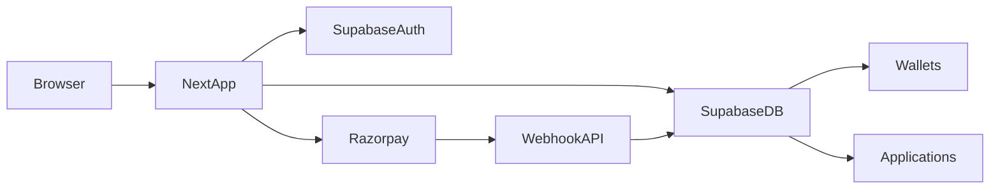

# DigiConnect Dukan V6 — Architecture

## Product shape

Minimal Digital Services Platform:

- **Public site:** home, services, about, contact, legal, track, login/signup
- **Customer:** dashboard, profile, wallet, notifications, pay, invoice
- **Agency Partner (`/ap`):** dashboard, customers, applications, commissions, wallet/payouts, support
- **Admin (`/admin`):** dashboard, customers, applications, services, payments, partners, coupons, wallet, notifications, website settings, reports

## Roles

One resolver: [`src/lib/auth.ts`](src/lib/auth.ts)

| Role | Home |
|---|---|
| `admin` | `/admin` |
| `agency_partner` | `/ap/dashboard` |
| `customer` | `/customer/dashboard` |

Middleware enforces route ownership. Legacy `/agent` and `/dashboard` redirect into V6 paths.

## Auth

Single system: **Supabase Auth**

- Email/password signup + login
- Email verification / password reset APIs under `/api/auth/*`
- WhatsApp OTP: `/api/auth/send-whatsapp-otp`, `verify-whatsapp-otp`
- No PIN auth, no parallel JWT cookie stacks

## Data flow



## Services

Canonical list in [`src/lib/services-data.ts`](src/lib/services-data.ts) + `public.services` table.

Pages: `/services` and `/services/[slug]` (SSG for 7 slugs).

## Payments

1. Create application (customer or AP)
2. `POST /api/create-order` → Razorpay order + `payments` row
3. Client checkout → `POST /api/verify-payment`
4. Webhook backup: `/api/razorpay/webhook`
5. Invoice row + optional wallet cashback

## Folder map (target)

```text
src/app/                 # routes only (public, customer, ap, admin, api)
src/components/          # small shared UI
src/lib/                 # auth, services, wallet, razorpay, supabase
supabase/migrations/     # single baseline
supabase/migration-archive/v5-history/  # frozen legacy SQL
```

## Stack

Next.js 15 App Router · React 19 · TypeScript · Tailwind v4 · Supabase/Postgres · Razorpay · pnpm
